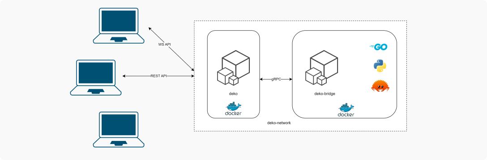

[](LICENSE)

## About DEKO

DEKO is a powerful online compiler built from scratch using Golang and gRPC. Unlike other compilers, DEKO offers both REST and WebSocket APIs, allowing users to compile code and receive real-time output in Go and Python, with Plans to support other languages as well.

The idea for DEKO came from the limitations of existing compilers, which often only support REST APIs and provide outdated language versions. To address these shortcomings, DEKO was designed to provide a more flexible and powerful solution for compiling and executing code.

DEKO's unique features include its real-time output capabilities, which allow users to receive feedback on their code as soon as it's generated in the server. Additionally, DEKO offers support for multiple programming languages and enables users to deploy their own setups using Docker containers.

As a fully open-source project, DEKO welcomes contributions and improvement suggestions from the community. To get involved, users can connect with the project's sole developer via email at sonukumarsaw66@gmail.com.

Overall, DEKO is a powerful and versatile online compiler that provides a flexible and user-friendly solution for compiling code in a variety of programming languages.

## Deploy Procedure 

1. Install [Docker](https://docs.docker.com/) and [Docker Compose](https://docs.docker.com/)
2. Clone the source code and get the latest code
    ```git
    git clone https://github.com/dev-saw99/deko.git
    git pull origin main
    ```
3. Create and run docker containers
    ```docker 
    docker-compose up -d
    ```
4. You can now access DEKO at `localhost:9000`

## High Level Diagram



## API Documentation


## Contribution

At DEKO, I am always looking to improve the platform and welcome contributions and feedback from the community. Whether you're a seasoned developer or just getting started, there are many ways you can get involved and help make DEKO even better.

If you have ideas for new features, improvements, or bug fixes, please don't hesitate to reach out to me. You can submit your suggestions and feedback via our Github repository or contact me directly at sonukumarsaw66@gmail.com.

Thank you for your interest in DEKO. We look forward to working with you to make our platform even better.